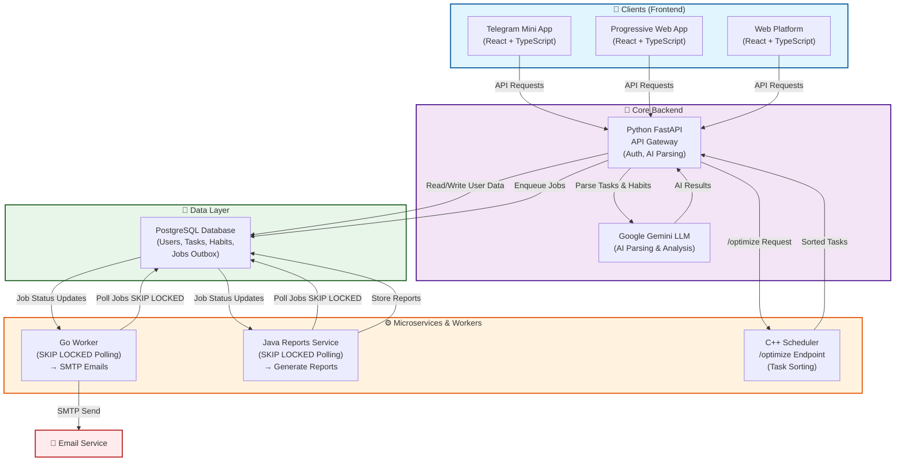

# AI Day Planner

Современная система планирования задач на основе ИИ с микросервисной архитектурой.

## 🚀 Возможности

- **Естественный язык**: Создание задач через текстовые описания с ИИ-парсингом
- **Оптимизация расписания**: Автоматическая оптимизация порядка задач
- **Кросс-платформенность**: Telegram Mini App + PWA + веб-приложение
- **Асинхронная обработка**: Фоновые воркеры для уведомлений и обработки
- **Микросервисы**: Полилинговая архитектура (Python, Go, TypeScript, Java, C++)

## 🏗️ Архитектура

## System Architecture



### Сервисы

- **api-python**: FastAPI backend с PostgreSQL
- **worker-go**: Go воркер для уведомлений
- **bot-js**: Telegram бот
- **web-platform**: React PWA frontend
- **miniapp-ts**: Telegram Mini App
- **reports-java**: Java сервис отчетов (экспериментальный)
- **scheduler-cpp**: C++ оптимизатор расписания (экспериментальный)

### Технологии

- **Frontend**: React 19, TypeScript, Vite, Emotion, PWA
- **Backend**: FastAPI, SQLAlchemy, asyncpg, Alembic
- **Database**: PostgreSQL с миграциями
- **Async**: Go воркеры, PostgreSQL как очередь
- **AI**: Google Gemini для парсинга текста
- **Deployment**: Docker Compose

## 📋 Быстрый запуск

### Предварительные требования

- Docker Desktop
- Node.js 20+ (для локальной разработки)
- Python 3.11+ (для локальной разработки)

### Запуск через Docker

```bash
# Из корня проекта
docker-compose up --build
```

После запуска:
- **Frontend**: http://localhost:5173
- **API**: http://localhost:8000
- **API Docs**: http://localhost:8000/docs
- **Database**: postgres://localhost:5432 (user: planner, pass: planner)

### Локальная разработка

#### Backend (Python)

```bash
cd ai-planner-monorepo/services/api-python
cp .env.example .env
# Отредактируйте .env при необходимости
pip install -r requirements.txt
alembic upgrade head
uvicorn app.main:app --reload
```

#### Frontend

```bash
cd ai-planner-monorepo
pnpm install
pnpm dev --filter web-platform
```

#### Worker (Go)

```bash
cd ai-planner-monorepo/services/worker-go
cp .env.example .env
go run main.go
```

## 🧪 Тестирование

```bash
# Python тесты
cd ai-planner-monorepo/services/api-python
pip install pytest
pytest

# Go тесты
cd ai-planner-monorepo/services/worker-go
go test -v

# TypeScript сборка
cd ai-planner-monorepo
pnpm build
```

## 📚 Документация

- [Архитектурный отчет](ai-planner-monorepo/ARCHITECTURE_REPORT.md)
- [API документация](http://localhost:8000/docs) (после запуска)

## 🎯 Демонстрация

1. Запустите `docker-compose up --build`
2. Откройте http://localhost:5173
3. Создайте задачу через текстовое описание
4. Просмотрите оптимизированное расписание
5. Проверьте Telegram интеграцию (опционально)

## 🔧 Конфигурация

### Переменные окружения

Скопируйте `.env.example` в `.env` для каждого сервиса и настройте:

- `DATABASE_URL`: PostgreSQL connection string
- `GEMINI_API_KEY`: Google AI API key (опционально)
- `TELEGRAM_BOT_TOKEN`: Telegram bot token (опционально)
- `SMTP_*`: Email настройки (опционально)

### Development mode

Для демонстрации установите `ALLOW_DEV_INIT_DATA_BYPASS=true` в API .env

## 📈 Производственная готовность

- ✅ Health checks
- ✅ Graceful degradation
- ✅ Transactional job queue
- ✅ Cross-platform PWA
- ✅ Comprehensive logging
- ✅ Docker containerization
- ✅ CI/CD pipeline
- ⚠️  Monitoring/metrics (можно добавить)
- ⚠️  Security audit (рекомендуется)

## 🤝 Вклад

Проект разработан как дипломная работа. Для улучшений:

1. Fork репозиторий
2. Создайте feature branch
3. Добавьте тесты
4. Отправьте PR

## 📄 Лицензия

MIT License
