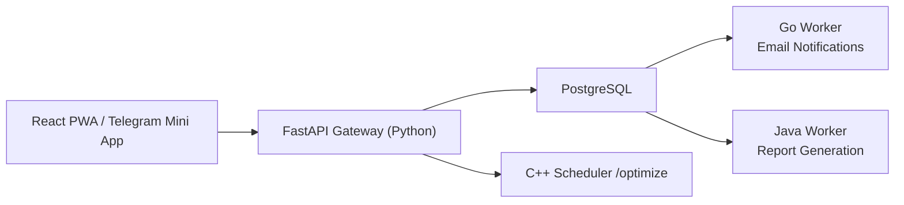

# 🏛️ AI Planner Architecture & Readiness Report

## 🚀 Executive Summary

AI Planner is a production-oriented polyglot microservices system designed to turn natural-language planning requests into structured, optimized, and asynchronously processed daily schedules.

From an enterprise architecture perspective, the platform demonstrates several high-value qualities:

- **Polyglot specialization**: each service is implemented in the language best suited to its responsibility.
- **Operational resilience**: critical user flows continue to work even when optional subsystems such as AI parsing or the C++ scheduler are unavailable.
- **Security-aware design**: authentication is based on Telegram HMAC validation with a controlled local-development bypass.
- **Scalable asynchronous processing**: PostgreSQL is used not only as a system of record, but also as a transactional job queue using row-level locking.
- **Cross-platform delivery**: the frontend operates as both a Telegram Mini App and a standalone Progressive Web App (PWA) with a premium mobile UX.

In its current state, the project is not merely a prototype UI over a CRUD backend. It is an integrated distributed system that demonstrates:

- synchronous gateway-style API orchestration,
- asynchronous worker processing,
- transactional outbox behavior,
- service-level graceful degradation,
- mobile-first product delivery without app-store dependency.
- 

---

## 🧰 Technology Stack

### Frontend Experience

- **React 19**
- **TypeScript**
- **Vite**
- **vite-plugin-pwa**
- **Emotion (`@emotion/react`, `@emotion/styled`)**
- **Telegram Web Apps SDK**

### API & Orchestration Layer

- **Python 3**
- **FastAPI**
- **SQLAlchemy 2.x (async)**
- **asyncpg**
- **httpx**
- **Alembic**

### Asynchronous Background Services

- **Go**
  - PostgreSQL worker
  - SMTP email notification delivery
  - `FOR UPDATE SKIP LOCKED` queue consumption

- **Java / Spring Boot**
  - Reporting worker
  - scheduled polling of report-generation jobs

- **C++17**
  - lightweight HTTP optimization engine
  - `cpp-httplib`
  - `nlohmann/json`

### Data & Infrastructure

- **PostgreSQL 15**
- **Docker Compose**
- **Multi-stage Docker builds**
- **Environment-based configuration**

### Shared Contracts & Validation

- **Zod contracts package**
- **Pydantic validation**

---

## 🧭 Architecture Topology

The platform is organized around a **gateway + database + workers** model:

- The **frontend** communicates only with the **Python FastAPI API**.
- The **FastAPI service** handles:
  - authentication,
  - request validation,
  - task and habit persistence,
  - AI parsing,
  - job creation in the `jobs` table,
  - synchronous delegation to the C++ optimizer.
- **PostgreSQL** plays two roles:
  - primary transactional data store,
  - transactional job queue / outbox.
- The **Go worker** consumes `send_notification` jobs and sends email notifications.
- The **Java worker** consumes `generate_report` jobs and processes reporting tasks.
- The **C++ scheduler** is invoked synchronously over HTTP for task optimization.

### Mermaid Topology

### Runtime Communication Model

- **Frontend -> API**
  - HTTPS/HTTP JSON
  - Telegram `initData` header or standalone dev-auth fallback

- **API -> PostgreSQL**
  - async SQLAlchemy + asyncpg
  - transactional writes for tasks, habits, users, jobs

- **API -> C++ Scheduler**
  - async HTTP call
  - short timeout
  - graceful local fallback sorting

- **PostgreSQL -> Go / Java Workers**
  - polling workers
  - atomic row acquisition with `FOR UPDATE SKIP LOCKED`

---

## 🧠 Core Architectural Patterns

### 1. Polyglot Microservices Architecture

The system intentionally assigns different languages to distinct responsibilities:

- **Python** for rapid API composition, validation, authentication, and AI integration
- **Go** for lean, efficient queue consumption and notification delivery
- **Java** for enterprise-style scheduled reporting workloads
- **C++** for lightweight, high-performance optimization logic
- **TypeScript/React** for premium user-facing interaction

This is a strong architectural demonstration of **technology fit by responsibility**, not arbitrary language mixing.

### 2. Transactional Outbox / Database-as-Queue

When a task is created, the API writes both:

- the business entity (`tasks`)
- the corresponding asynchronous work item (`jobs`)

This is effectively a **transactional outbox pattern**, implemented without a separate broker.

Benefits:

- no dual-write race between business data and event/job creation
- simpler infrastructure footprint
- easier local deployment and thesis demonstration

### 3. Competing Consumers with PostgreSQL Row Locking

Both workers use the database safely through:

- `FOR UPDATE SKIP LOCKED`
- atomic job claiming
- status progression such as `pending -> processing -> completed/failed`

This pattern gives the system queue-like behavior without RabbitMQ or Kafka, while preserving correctness under concurrency.

### 4. Graceful Degradation / Resilience by Design

The architecture contains explicit fallback paths:

- if **Gemini AI** is unavailable, task parsing falls back to local parsing logic
- if the **C++ scheduler** is unavailable, optimization falls back to Python sorting
- if **SMTP** credentials are missing, the Go worker simulates notification success instead of crashing
- if the app is opened outside Telegram, the PWA falls back to standalone login mode

This is a major engineering strength: the system is designed to **continue serving the user**, not simply fail closed on every dependency issue.

### 5. Multi-Tenancy by User Context

The API enforces per-user isolation through:

- authenticated user resolution
- automatic user registration
- repository and service filtering by `user_id`

Tasks and habits are never treated as globally shared data; they are scoped to the authenticated user.

### 6. Gateway / Orchestrator API Pattern

FastAPI acts as the orchestration layer between:

- user-facing clients,
- the data store,
- AI parsing,
- optimization service,
- and asynchronous background services.

This is effectively an **API Gateway + Application Service Layer** combined into a single operational boundary.

---

## 🏆 Key Engineering Achievements

## 1. Resilience

- **AI fallback**: task parsing remains operational even if Gemini is unavailable.
- **Optimization fallback**: `/tasks/optimized` still returns a valid result if `scheduler-cpp` is down.
- **Standalone auth fallback**: the frontend can run outside Telegram as a real PWA.
- **Worker fallback**: email delivery does not crash the worker when SMTP credentials are absent.

Why this matters:

- The platform demonstrates service resilience under partial subsystem failure.
- This is especially important for demos, university defense environments, and constrained deployments.

## 2. Concurrency Control Without Broker Overhead

- Go and Java workers use PostgreSQL row locking with `FOR UPDATE SKIP LOCKED`.
- This avoids introducing RabbitMQ/Kafka while still supporting safe concurrent processing.

Why this matters:

- Lower infrastructure complexity
- Fewer operational dependencies
- Strong academic demonstration of transactional concurrency patterns

## 3. Security

- Telegram authentication is validated using **HMAC-SHA-256**
- Requests without valid `X-Telegram-Init-Data` are rejected
- The dev-bypass path is explicitly gated by configuration

Why this matters:

- The system does not rely on insecure mock auth in normal operation
- Developer convenience is isolated from production behavior

## 4. Cross-Platform Delivery

- The frontend works as a **Telegram Mini App**
- It also works as a **standalone PWA**
- iOS-oriented meta tags and standalone mode make it feel native when added to the Home Screen

Why this matters:

- No app store dependency
- Wider accessibility
- Strong mobile UX story for both Telegram and browser users

## 5. Premium Frontend Experience

- Mobile-first layout
- glassmorphism and modern card design
- premium action hierarchy
- responsive desktop centering that mimics a mobile device shell

Why this matters:

- The UI now reflects the sophistication of the backend architecture
- This improves stakeholder perception during demos and defense presentations

---

## 🔐 Security & Identity Model

### Authentication

- Primary auth mechanism: **Telegram Web App `initData`**
- Validation method: **HMAC-SHA-256**
- Header used: `X-Telegram-Init-Data`

### Local Development Support

- `ALLOW_DEV_INIT_DATA_BYPASS` enables controlled local bypass
- `dev-mode-init-data` maps to a deterministic local dev user
- This enables frontend development without weakening the production auth model

### Data Isolation

- user auto-registration on first valid request
- all task/habit queries filtered by authenticated user
- multi-tenant behavior enforced in API, repositories, and services

---

## 📦 Service Inventory

### 1. `apps/miniapp-ts`

Responsibility:

- premium React PWA
- Telegram Mini App UI
- standalone browser/PWA UI

Key capabilities:

- standalone login fallback
- task creation
- task listing
- optimized schedule visualization
- PWA installability

### 2. `services/api-python`

Responsibility:

- system gateway and orchestration layer

Key capabilities:

- auth and user resolution
- task/habit CRUD
- AI task parsing
- scheduler proxying
- outbox/job production
- resilience fallbacks

### 3. `services/worker-go`

Responsibility:

- consume notification jobs from PostgreSQL
- deliver email notifications over SMTP

Key capabilities:

- safe job claiming
- graceful shutdown
- SMTP-based delivery
- simulation fallback when SMTP is not configured

### 4. `services/reports-java`

Responsibility:

- consume report-generation jobs
- produce reporting output asynchronously

Key capabilities:

- scheduled polling
- native SQL job acquisition
- job state transitions

### 5. `libs/scheduler-cpp`

Responsibility:

- optimize task ordering

Key capabilities:

- lightweight HTTP server
- deterministic sorting
- fast stateless operation

---

## 📈 Scalability Considerations

The current design is appropriate for a thesis-scale and early production-scale system, with clear expansion paths.

### Horizontal Opportunities

- multiple Go workers can be run concurrently
- multiple Java workers can be run concurrently
- API instances can be scaled behind a reverse proxy
- C++ scheduler can be replicated as a stateless service

### Practical Bottlenecks to Monitor

- PostgreSQL may become the central scaling bottleneck if job throughput grows significantly
- synchronous AI and scheduler calls increase dependency latency on the API path
- Docker Compose is suitable for local orchestration, but not a long-term production orchestrator

### Future Evolution Path

- introduce Redis/Kafka/RabbitMQ only if queue scale justifies it
- place API behind Traefik/Nginx
- move to Kubernetes or Nomad for production orchestration
- add observability stack (Prometheus/Grafana/OpenTelemetry)

---

## ✅ Production Readiness Checklist

- ✅ **Containerization**: core services are Dockerized with service-specific Dockerfiles
- ✅ **Orchestration**: Docker Compose defines the multi-service topology
- ✅ **Database health gate**: PostgreSQL uses a healthcheck before dependent services start
- ✅ **Async database access**: FastAPI uses async SQLAlchemy + asyncpg
- ✅ **Schema management**: Alembic is present for Python-side schema evolution
- ✅ **Service decomposition**: responsibilities are cleanly separated across languages
- ✅ **Transactional queue pattern**: PostgreSQL `jobs` table is used as a reliable outbox/queue
- ✅ **Concurrency safety**: workers use `FOR UPDATE SKIP LOCKED`
- ✅ **Graceful degradation**: critical user flows survive dependency outages
- ✅ **Multi-tenancy**: user data is isolated by authenticated identity
- ✅ **PWA readiness**: manifest, service worker, installability, iOS standalone support
- ✅ **Environment separation**: service configuration is environment-driven
- ✅ **Local developer experience**: auth bypass and standalone PWA mode support rapid development

### Remaining Recommendations Before Full Production

- ⚠️ Add formal DB migrations for every recent dev-time schema evolution, especially local SQLite compatibility changes
- ⚠️ Add centralized structured logging and distributed tracing
- ⚠️ Add automated CI/CD quality gates for Python, TypeScript, Go, Java, and C++
- ⚠️ Add secret management beyond local `.env` files
- ⚠️ Add integration tests for Dockerized end-to-end startup

---

## 🧪 Demonstrated Readiness

Based on the current repository state, the system already demonstrates:

- a real distributed architecture
- cross-language service integration
- secure user scoping
- asynchronous workflow orchestration
- modern cross-platform frontend delivery
- thoughtful resilience under degraded dependency conditions

This is a strong and credible example of an **enterprise-grade academic system**: sophisticated enough to demonstrate architectural depth, yet pragmatic enough to run locally and be defended clearly in front of a technical review committee.

---

## 🏁 Final Assessment

AI Planner is architecturally mature for a thesis, stakeholder demo, or advanced capstone presentation.

It successfully combines:

- **enterprise patterns**
- **polyglot service specialization**
- **mobile-first product thinking**
- **security-aware authentication**
- **operational resilience**
- **clear scalability paths**

In short:

> **AI Planner is not just a feature-complete app. It is a well-structured distributed system that demonstrates real engineering judgment.**
